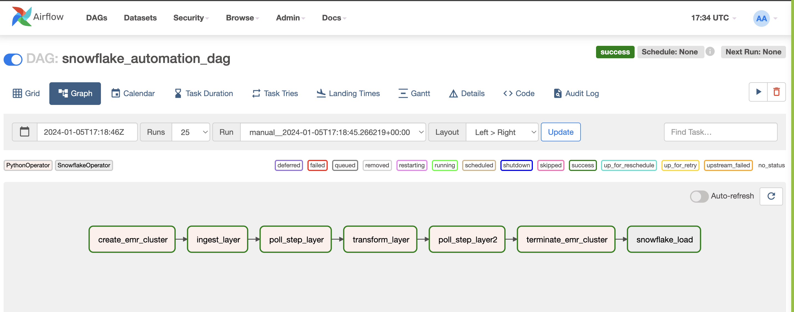

# DataWorld Insights : Transforming, Loading and Visualizing Jobs in Data World.

### Executed ETL processes for a 10k-row dataset in the data jobs domain, leveraging Apache Pyspark for transformation and AWS services such as EC2, EMR, and S3 for ETL workflows, resulting in a streamlined data pipeline.

### Implemented batch processing and conducted data modeling in Snowflake, authoring SQL code to optimize data storage and retrieval, enhancing efficiency in managing large-scale datasets.

### Workflow:

### Integrated Tableau for data visualization, extracting Snowflake data to craft a dashboard featuring 4-5 visualizations, providing actionable insights into the Jobs in Data World dataset.

### Dashboard Link :  [Tableau Dashboard ](https://public.tableau.com/app/profile/harshitha.b.nagaraj/vizzes)  👈

### Dashboard Image : 

