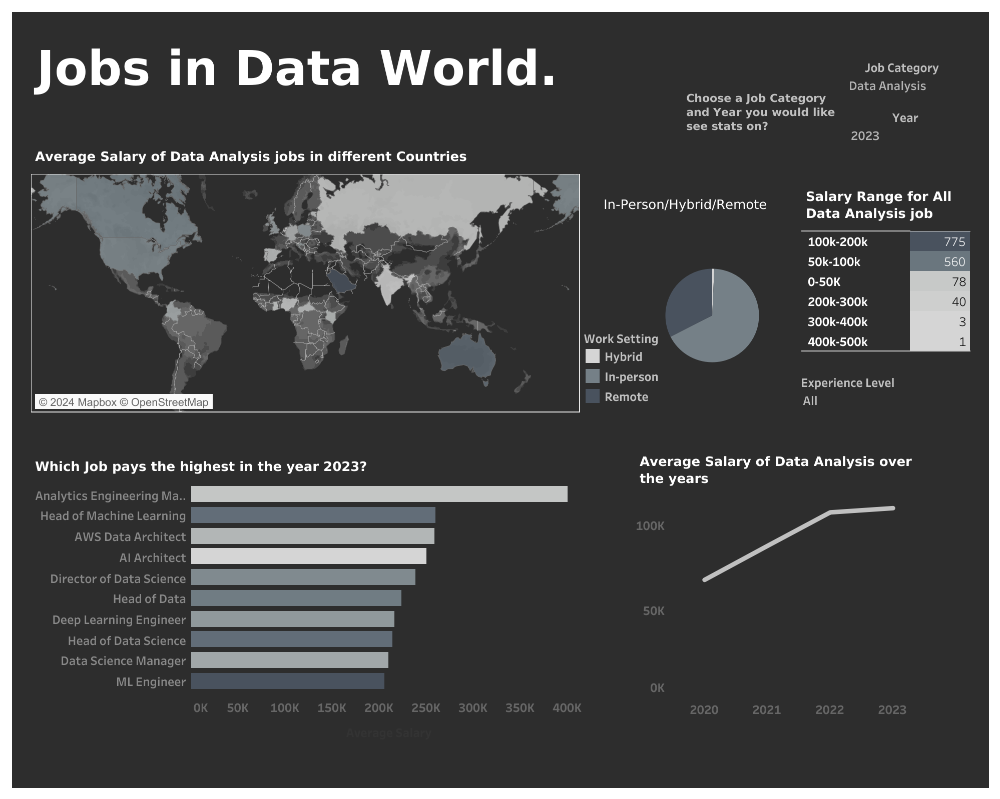

# Project Title : DataWorld Insights : Transforming, Loading and Visualizing Jobs in Data World.

* #### Domain: Data Engineering, Data Visualization

* #### Skills Used: ETL, AWS, SQL, Tableau , Apache Pyspark

* #### Project Overview: Implemented ETL processes for a 10k-row data jobs dataset using Apache Pyspark and AWS (EC2, EMR, S3), conducted data modeling in Snowflake, optimized storage with SQL, and created a Tableau dashboard with 4-5 visualizations for actionable insights.

* ### Insights:

  #### 1. Working together in person is still crucial for getting the best out of data professionals.
  #### 2.Data jobs are paying more in 2023, showing that companies really value people who know how to work with data.
  #### 3.Also, the job that pays the most is called Analytics Engineering Manager, a role that combines analyzing data and handling it like an engineer. This job is in demand because it's all about making sense of data for smart decision-making.

* ### Learning:

  #### 1.AWS services like EC2 and EMR provide scalable solutions for growing data processing needs.
  #### 2.Cost savings result from paying only for the computing power and storage used in AWS.
  #### 3.AWS S3 offers flexible storage that integrates seamlessly with other AWS services.
  #### 4.Tableau easily works with Snowflake, helping us visualize and understand our data stored there.

* #### Conclusion: Completing the ETL processes and finding useful insights show how having diverse skills in handling data and creating visualizations is crucial. This project's impact demonstrates how data jobs are changing, paving the way for more improvements in using data for smart decision-making.

  

### Workflow:

### Dashboard Link :  [Tableau Dashboard ](https://public.tableau.com/app/profile/harshitha.b.nagaraj/viz/JobsinDataWorld/MainDashboard)  👈

### Dashboard Image : 

